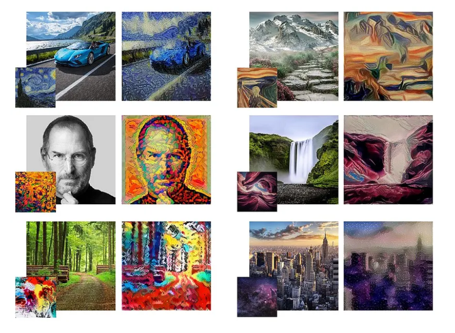

# Style Transfer + Model Distillation (TensorFlow/Keras)

This project implements a **Neural Style Transfer** pipeline that uses a high-quality VGG19-based *teacher model* and a lightweight, real-time *student model* trained via knowledge distillation. Designed for deployment, it features a Flask web interface and is containerized with Docker for cloud readiness.

Deployed on: https://styliqueai.azurewebsites.net/

---

## Features

- **VGG19 teacher** for detailed artistic stylization  
- **Lightweight student model** (U-Net/CNN) for fast inference  
- **Custom training pipeline** using teacher-generated data  
- **Flask web app** for interactive upload & preview  
- **Modular codebase** with separate components for cleaning, preprocessing, training, and inference  
- **Dockerized** for easy deployment (Azure-ready)

---

## Project Structure

```
├── app.py                     # Main Flask app (frontend + inference logic)
├── DataCleaner.py             # Image filtering & dataset cleaning utilities
├── DataProcessor.py           # Data loader and augmentation logic
├── Dockerfile                 # Docker setup for full app deployment
├── ModelRunner.py             # Abstraction to run teacher/student models
├── ModelTrainer.py            # Training script for student model
├── style_transfer_logic.py    # Inference logic (used by Flask)
├── utils.py                   # Helper functions (e.g., image loading)
├── style_transfer_model.png   # Architecture diagram or sample image
├── requirements.txt           # Python dependency list
├── README.md
│
├── models/                    # Saved models (e.g., .keras files)
├── static/                    # Static web assets (uploads, styles, results)
└── templates/                 # HTML templates (Jinja2: index.html, result.html)
```

---

## Requirements

Install dependencies with:

```bash
pip install -r requirements.txt
```

**Key Libraries:**
- TensorFlow 2.x  
- Flask  
- Pillow  
- NumPy  
- gunicorn  
- Werkzeug  

---

## Running the App

### 1. **Local (Flask Dev Server)**
```bash
python app.py
```
Then go to `http://localhost` in your browser.

---

### 2. **Docker Build & Run**
```bash
docker build -t style-transfer-app .
docker run -p 80:80 style-transfer-app
```

---

### 3. **Deploying on Azure App Services**
- Push the Docker image to Azure Container Registry  
- Deploy via Azure App Services with container option  
- Use environment variable: `FLASK_SECRET_KEY` (optional but recommended)

---

## Training Overview

The **teacher model** (VGG19) produces stylized outputs from content/style pairs.  
The **student model** is trained on this output using perceptual loss + image reconstruction, allowing:

- Faster inference (real-time)
- Smaller model size (deployable anywhere)
- Maintain near-teacher visual quality

Use `ModelTrainer.py` for training and `ModelRunner.py` for running both models in isolation.

---

## Web Interface

The app provides:

- Drag-and-drop or file upload for **content and style images**  
- Option to select from **predefined styles**  
- **Dual output view** (teacher and student results)  
- Configurable **iteration counts** for both models  
- Downloadable results with performance stats

---

## Preview



---
